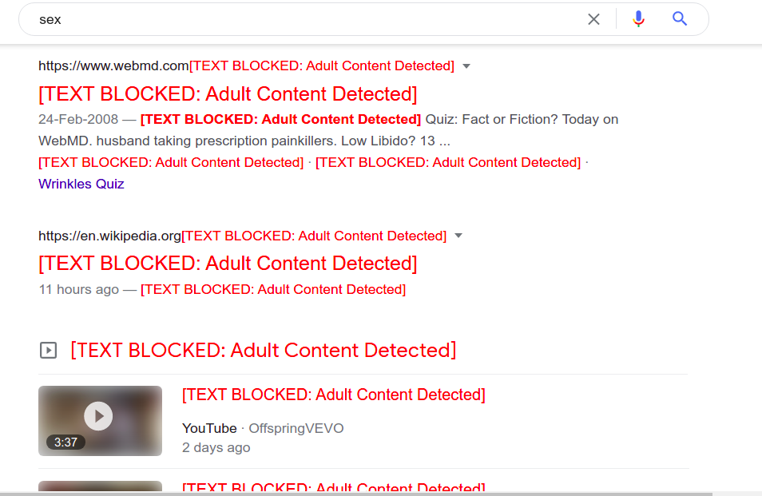

# :sparkles: Hide Adult Content  - Chrome Extension 

This extension will save you from reading any Adult Content as well as visual images.  

This extension is developed by **Abhishek Swami**, a Software Engineer who is making world a better place by making cool web projects, programming, data structures, algorithms, and more!   

> ## Never Under Estimate the power of a Frustrated Software Developer

I am not an expert with Google Chrome Development and this is my first extension made ever. 

 

# Features
- **Adult Content Blocking**: Searches entire web page and replaces Adult text with text `##[TEXT BLOCKED: Adult Content DETECTED]`
- **Image Blurring**: Blurs the neighbouring Images which are relevant and might show 18+ image.
- **Simple, BugLess and Easy**: If there's a bug, it's a feature.
- **Customizable**: As you have the source code, you can customize it as per your needs ;) 

# How To Use?
- Clone this repository or download as a zip file
- Incase you downloaded as a zip, unzip it
- Open Google Chrome
- Go to `chrome://extensions`
- Click on `Load Unpacked` which you can see in the top left side.
- Select the path where you cloned/downloaded this project.
- An icon  should appear besides your Chrome Search bar.

# Why this Chrome Extension exists?
When I created this extension, its purpose was: 
- An attempt to save young generation from Adult Content  
- To learn how to creat kick-ass Chrome Extensions
